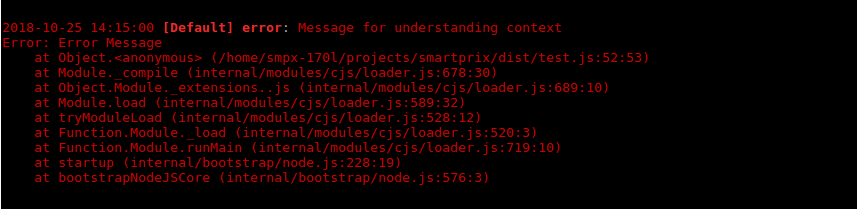

# oak
A simple logger that writes to json file, console, or any other custom transport.

### Install

	yarn add @smpx/oak
  
### Use

```js
// You can also use default import
import {Oak} from '@smpx/oak';

Oak.log('This is a simple message');

// The first argument is special, if it is a plain object it will be parsed and
// properties will be displayed seperate from the message.
// Some special properties are duration, label, level, error (an object itself), duration, createdAt
Oak.info({label: 'Apply a label'}, 'You can', 'Chain', 'Like in console', 0, 'Other types than string too');
```

##### Preview:


#### Timers

```js
Oak.time('Unique message');

Oak.timeEnd('Unique message', 'Extra info', 'just like in Oak.log');

// Alternative timers

const key = Oak.time();

Oak.timeEnd(key, 'Extra info', 'just like in Oak.log');
```

##### Preview:


```js
// Function to time
async function fnToTime() {
	return new Promise(resolve => setTimeout(resolve, 3000));
}

// Time functions (Returns a promise)

// The last argument needs to be the function to time
Oak.logTimeTaken(fnToTime);

Oak.logTimeTaken({label: 'Timer'}, 'Just like', 'Oak.log', fnToTime);
```

##### Preview:


#### Create Instances

```js
import {Oak} from '@smpx/oak';

const oak = new Oak('instanceLabel');

// This instance will have the label set to 'instanceLabel' automatically.
oak.log('Test');


const oak2 = new Oak({label: 'new', info: 'This is instance oak2'});

oak2.warn('Extra info will be attached');
```

##### Preview:


#### Error parsing

```js
import {Oak} from '@smpx/oak';

Oak.error('Message for understanding context', new Error('Error Message'));
```

##### Preview:


### Install Exception Handlers and Process Exit Handlers

```js
import {Oak} from '@smpx/oak';

Oak.installExceptionHandlers();
Oak.installExitHandlers();

```
##### Preview:


### Transports

By default Oak comes with the ConsoleLogs transport set. A FileLogs transport is also included.
The transports are global for now, feel free to open a PR that adds an option to set instance level transports.

To use it do:

```js
import {Oak, FileLogs} from '@smpx/oak';

Oak.setTransports([new FileLogs({path: 'path/to/folder/for/logs', table: 'filename/for/logs'})])

```

It uses the [rotating-file-stream](https://github.com/iccicci/rotating-file-stream#readme) module behind the scenes and saves each log object in json logs. They are rotated every day and kept for 10 days.


You can build your own custom transport, we have a `BasicLogs` transport that you can import and extend. Just implement a simple log function, that is all that's needed.

```js
import {Oak, BasicLogs} from '@smpx/oak'

class CustomTransport extends BasicLogs {
	log(info) {
		// info is an object, with all the properties set in global options, any options passed to log function, 'level', 'message', 'label', and 'duration' (if using time functions) properties.
		console.log(info);
	}
}

```

### oak-viewer CLI

A simple CLI to stream logs saved by FileLogs transport. This is more of a custom implentation for our needs, with properties highlighted that we have set in global options.

```
Usage: oak-viewer [app] [options]

View logs generated by oak's FileLogs in awesome formatting
Examples:
oak-viewer --err --lines=100
oak-viewer sm-crawler --level=warn,err --label=knex,koa
oak-viewer --grep=NotFoundError,InternalServerError

To negate a condition you can prepend the value with ~
Examples:
oak-viewer --level=~silly --label=~maxmind,~jsonld
oak-viewer ~list-crawler --level=err --grep=~NotFoundError


Options:
  -v, --version            output the version number
  -p, --path [dir]         Path given to filelogs (default is logs folder in root dir)
  --file, --table [table]  Table option given to FileLogs (default is 'log')
  -d, --date [date]        Date for which to view logs [format: YYYY-MM-DD]
  --err, --error           Only show errors
  --lines [lines]          Show this many previous lines (default 10)
  --level [levels]         Only show these levels, --levels=info,err
  --label [labels]         Only show these labels, --labels=knex,koa
  --grep [regex]           Only show logs matching this regex, --grep=NotFoundError
  --fields [fields]        Only show these fields in a log message, --fields=level,ctx.url
  --match [match_regexes]  Advanced per field based filtering, --match="ctx.url:some_regex,sql:some_regex"
  -h, --help               output usage information
```